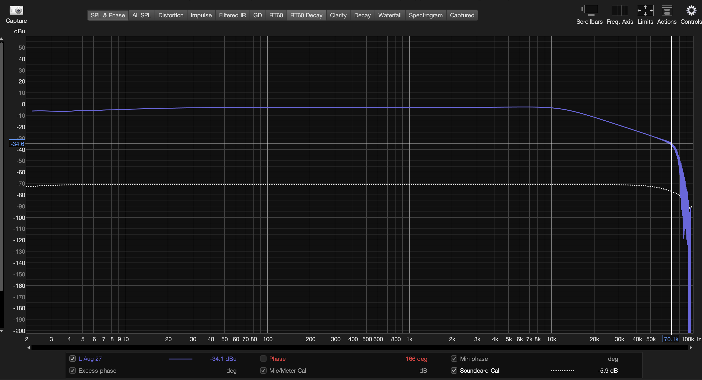
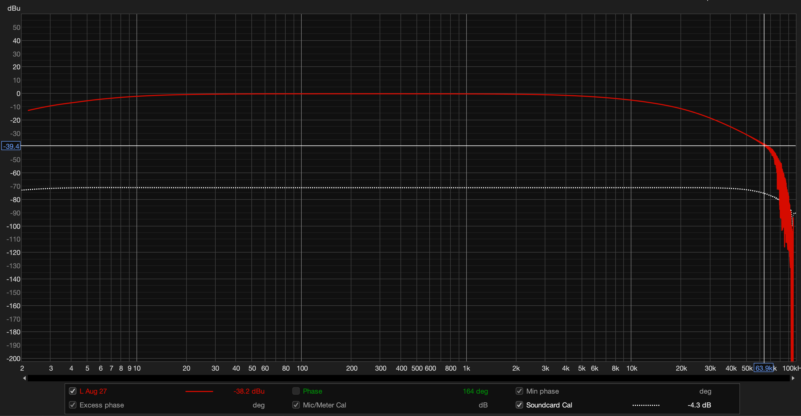
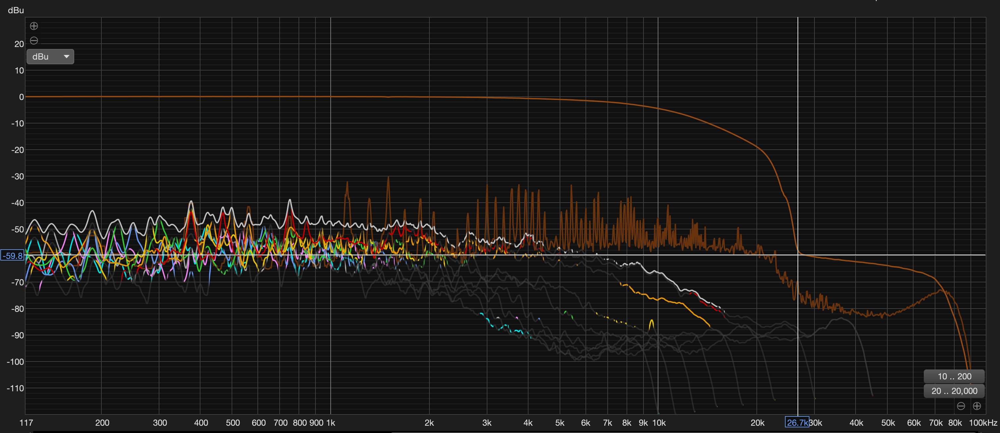
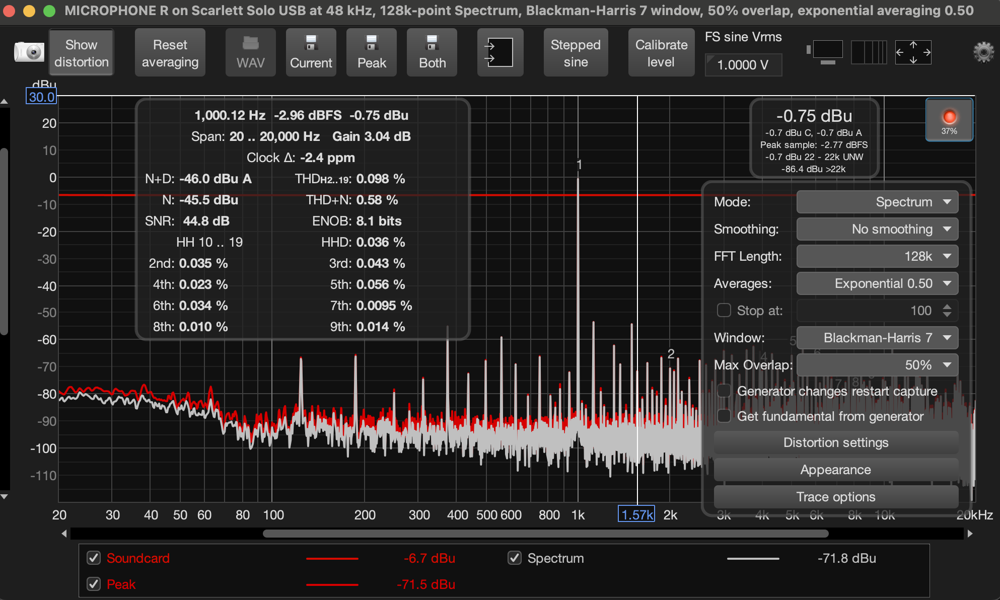
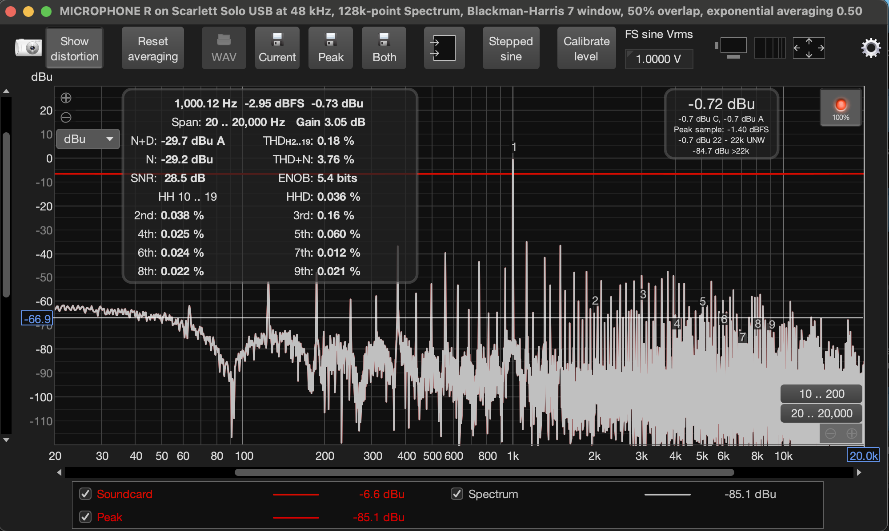
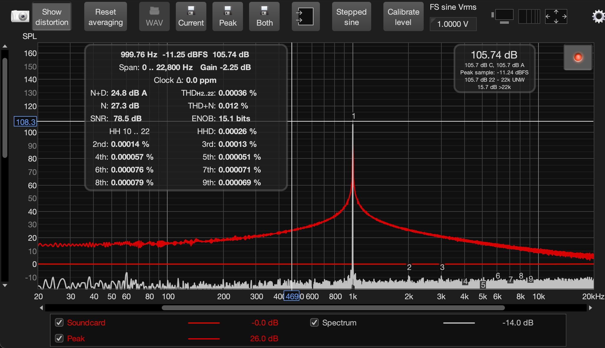

# Measurements

REW (Room EQ Wizard) can be an incredible tool for measuring the performance of audio gear on a budget, as it only requires an audio interface to work as both a function generator and a scope. 

## Sallen-Key filter performance

I measured the frequency response of both Sallen-Key filters to measure aliasing and imaging performance. The problem here is that my audio interface only goes up to 192kHz, and with the oversampling architecture used by the ADC and DAC of the pedal, aliasing and imaging starts being a problem at audio frequencies for inputs 172kHz to 192kHz, which my audio interface cannot output/measure. The DAC filter of the interface can also be seen taking effect past 70kHz, and thus I can only measure the filter's performance up to 70kHz. This is still helpful, as knowing the filter's performance at 70kHz gives us a generous lower bound of attenuation, and 172kHz should be >12dB lower than this bound given that it is well over an octave above 70kHz and the 2nd-order filters has a slope of 12dB/octave.

The calculated performance of these filters at 172kHz is -48.4 dB, so seeing roughly -30 to -35dB attenuation at 70kHz checks out. It's worth noting that the tone pot was also measured in the reconstruction filter sweep, though in its fully-open position. 

### Anti-Aliasing filter performance

### Reconstruction filter performance

### Full chain frequency response

Here we can see the decimation filter in action.

## Noise and Distortion Performance

I also used REW's RTA with a ~1kHz sine (adjusted to land directly on an FFT bin) to measure SNR and THD+N of the chain. In its current state on the breadboard, bumping the pedal can greatly affect its noise performance due to the many wires and jumper cables that sit loosely in the breadboard. Therefore this test can fluctuate heavily. These two show the best and worst case noise I was able to achieve on the breadboard. We can see that THD is relatively low compared to the noise, thereby heavily skewing the THD+N to the large noise floor.

# THD of Interface

